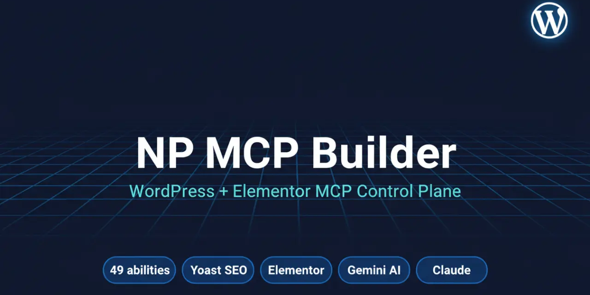

<div align="center">



# NP MCP Builder

**The complete WordPress + Elementor MCP control plane.**
~140 high-level abilities for AI assistants — content, media, SEO, full Elementor page-building (with Elementor 4.0 atomic elements support), site administration — exposed as MCP tools to Claude, ChatGPT and any MCP-compatible client.

[](https://wordpress.org/)
[](https://www.php.net/)
[](https://elementor.com/)
[](https://yoast.com/)
[](https://ai.google.dev/)
[](LICENSE)
[](https://github.com/hamzanabulse/np-mcp-builder/releases)
[](docs/SECURITY-AUDIT.md)

[Installation](#-installation) • [Abilities](#-abilities) • [Examples](#-examples) • [Architecture](#-architecture)

</div>

---

## ✨ Why NP MCP Builder?

Most MCP servers for WordPress expose low-level CRUD over the REST API and force the AI to do all the heavy lifting (build Elementor JSON node-by-node, write JSON-LD by hand, juggle Yoast meta keys). **NP MCP Builder ships a higher-level vocabulary**: an AI sends one call like *"build a landing page about dental implants in Amman with 6 FAQs and a sticky WhatsApp button"* and the plugin produces a fully-styled Elementor page, generates a hero image with Gemini, sets the featured image, writes Yoast OG/Twitter tags, injects FAQPage + LocalBusiness + BreadcrumbList JSON-LD, and clears the Elementor CSS cache — in a single tool call.

Built on top of the official [WordPress Abilities API](https://github.com/WordPress/abilities-api) and [WordPress/mcp-adapter](https://github.com/WordPress/mcp-adapter), with a dedicated atomic widget builder for full Elementor 4.0 page construction.

---

## 🚀 Highlights

- **Two MCP servers, one plugin** — `mcp-adapter-default-server` (42 NP tools) + `elementor-mcp-server` (69 atomic Elementor tools) = **111 tools total**.
- **AI-native image generation** — `np/generate-image` calls Google Gemini, resizes, converts to WebP, uploads to the Media Library with full SEO metadata (alt, title, caption, description).
- **Full Elementor 4.0 atomic page-building** — a dedicated MCP server exposes per-widget tools (`add-atomic-heading`, `add-atomic-button`, `add-flexbox`, `add-icon-box`, etc.), composite `build-page`, template apply/save, find/move/duplicate elements, and full schema introspection.
- **Auto JSON-LD schema** — `Schema_Builder` produces FAQPage, LocalBusiness/ProfessionalService, Service, BreadcrumbList, WebPage with AggregateRating + Reviews; injected into `<head>` from post meta.
- **Deep Yoast integration** — create/update posts with slug, categories, tags, featured image, JSON-LD, custom CSS/JS, focus keyword, meta description, canonical, OG/Twitter images and schema page type; read/write **global** Yoast settings, call Yoast's own `/yoast/v1/get_head` endpoint, and audit a whole site for missing SEO essentials.
- **Full site administration with safety confirmations** — list plugins/themes freely, while activate/deactivate plugins, switch themes, update site settings, change permalink structure, maintenance mode, and user mutations require `confirm=true`.
- **Tabbed admin dashboard** — Overview, Abilities (per-tool on/off toggles), Tools (one-click cache clear), Settings (Gemini key, image defaults, license activation), Maintenance, About.
- **Per-ability toggles** — disabled abilities are not registered with the Abilities API and not exposed via MCP — true zero-trust surface area.
- **Maintenance mode** — 503 page for visitors, admins keep working, `Retry-After` header for crawlers.
- **License-aware Free/Pro split** — see [Licensing](#-licensing).

---

## 📋 Requirements

| | Required for |
|---|---|
| WordPress 6.9+ | Abilities API |
| PHP 8.0+ | Plugin |
| [WordPress/mcp-adapter](https://github.com/WordPress/mcp-adapter) | Exposing abilities as MCP tools over HTTP |
| [Elementor](https://wordpress.org/plugins/elementor/) (free) | `elementor-mcp-server` + Elementor kit abilities |
| [Yoast SEO](https://wordpress.org/plugins/wordpress-seo/) (free) | `np/*-yoast-*`, `np/get-seo-head`, `np/audit-seo`, post-level SEO meta |
| Google AI Studio API key | `np/generate-image` |

---

## 🚚 Installation

### Option 1 — Clone from GitHub (recommended)

```bash
cd /var/www/your-wordpress/wp-content/plugins
git clone https://github.com/hamzanabulse/np-mcp-builder.git
wp --allow-root --path=/var/www/your-wordpress plugin activate np-mcp-builder
```

To pull future updates:

```bash
cd /var/www/your-wordpress/wp-content/plugins/np-mcp-builder
git pull
wp --allow-root --path=/var/www/your-wordpress plugin deactivate np-mcp-builder
wp --allow-root --path=/var/www/your-wordpress plugin activate np-mcp-builder
```

The deactivate/activate cycle forces WordPress to reload the new code (otherwise opcache may serve the old class definitions).

### Option 2 — ZIP upload

1. Download the latest ZIP from [Releases](https://github.com/hamzanabulse/np-mcp-builder/releases) (or **Code → Download ZIP**).
2. WordPress admin → **Plugins → Add New → Upload Plugin** → select the ZIP → **Install Now** → **Activate**.

> ⚠️ **Windows ZIP gotcha**: if you build/upload a ZIP from Windows and `unzip` on Linux, directories may lose execute bit and `vendor/elementor-mcp/` will silently fail to load. Fix:
> ```bash
> cd /var/www/your-wordpress/wp-content/plugins/np-mcp-builder
> find . -type d -exec chmod 755 {} +
> find . -type f -exec chmod 644 {} +
> ```

### Post-install setup

1. Open **NP MCP Builder** in the admin sidebar.
2. **Settings tab** → paste your Google Gemini API key (only required for `np/generate-image`).
3. Make sure [`mcp-adapter`](https://github.com/WordPress/mcp-adapter) is also installed and active.
4. **Abilities tab** → toggle off any tools you do not want exposed.

### Connect Claude Desktop

Generate an Application Password in **Users → Profile → Application Passwords**, then base64-encode `username:app-password`:

```bash
echo -n 'your-username:xxxx xxxx xxxx xxxx xxxx xxxx' | base64
```

Edit `claude_desktop_config.json` to register **both** MCP servers:

```jsonc
{
  "mcpServers": {
    "np-mcp-builder": {
      "command": "npx",
      "args": [
        "-y", "mcp-remote",
        "https://YOUR-SITE.com/wp-json/mcp/mcp-adapter-default-server",
        "--header", "Authorization: Basic YOUR_BASE64_TOKEN"
      ]
    },
    "np-mcp-elementor": {
      "command": "npx",
      "args": [
        "-y", "mcp-remote",
        "https://YOUR-SITE.com/wp-json/mcp/elementor-mcp-server",
        "--header", "Authorization: Basic YOUR_BASE64_TOKEN"
      ]
    }
  }
}
```

Restart Claude Desktop. You should see all 111 tools available across the two servers.

---

## 🧰 Abilities

### NP server — `mcp-adapter-default-server` (42 tools)

<details open>
<summary><b>Content (5)</b></summary>

| Tool | Purpose |
|---|---|
| `np/site-info` | Site name, URL, language, timezone, post counts. |
| `np/list-posts` | Paginated list of posts/pages with filters. |
| `np/get-post` | Read a single post with full Yoast meta. |
| `np/create-post` | Create post or page with categories, tags, featured image, Yoast meta. |
| `np/update-post` | Update any post field + Yoast meta. |

</details>

<details>
<summary><b>Media (1)</b></summary>

| Tool | Purpose |
|---|---|
| `np/generate-image` | Gemini → resize → WebP → Media Library with SEO metadata (alt/title/caption/description). |

</details>

<details>
<summary><b>Taxonomy (5)</b></summary>

| Tool | Purpose |
|---|---|
| `np/list-terms` | List terms in any taxonomy. |
| `np/create-term` | Create a term. |
| `np/update-term` | Rename / re-slug / re-parent. |
| `np/delete-term` | Delete term. |
| `np/set-post-terms` | Assign terms to a post. |

</details>

<details>
<summary><b>Theme customizer (2)</b></summary>

| Tool | Purpose |
|---|---|
| `np/get-theme-mod` | Read a Customizer value. |
| `np/set-theme-mod` | Set a Customizer value. |

</details>

<details>
<summary><b>Site administration (10)</b></summary>

| Tool | Purpose |
|---|---|
| `np/list-plugins` / `np/activate-plugin` / `np/deactivate-plugin` | Plugin inventory + control (refuses self-deactivation). |
| `np/list-themes` / `np/switch-theme` | Theme inventory + switching. |
| `np/get-site-settings` / `np/update-site-settings` | Core options (title, tagline, admin_email, timezone, …). |
| `np/update-permalinks` | Change permalink structure + flush rewrites. |
| `np/clear-cache` | Elementor `files_manager` + object cache + transient flush. |
| `np/maintenance-mode` | Toggle the built-in 503 page. |
| `np/system-info` | WP / PHP / MySQL versions + plugin/theme detection. |

</details>

<details>
<summary><b>Menus (5)</b></summary>

| Tool | Purpose |
|---|---|
| `np/list-menus` | List nav menus + theme locations. |
| `np/create-menu` | Create a menu, optionally seed with items (with nesting via `parent_index`). |
| `np/update-menu` | Replace items or change locations. |
| `np/delete-menu` | Delete a menu. |
| `np/assign-menu-location` | Assign menu → theme location. |

</details>

<details>
<summary><b>Users (4)</b></summary>

| Tool | Purpose |
|---|---|
| `np/list-users` | Paginated user list. |
| `np/create-user` | Create user with role + extended profile. |
| `np/update-user` | Update fields and role. |
| `np/delete-user` | Delete user, optional content reassign (refuses current user). |

</details>

<details>
<summary><b>SEO &amp; Elementor kit (6)</b></summary>

| Tool | Purpose |
|---|---|
| `np/get-yoast-global` / `np/update-yoast-global` | Organization, person, social, sitemap, breadcrumbs. |
| `np/get-elementor-kit` / `np/update-elementor-kit` | Active kit globals (colors, typography, container width). |
| `np/get-seo-head` | **Yoast-rendered head** (HTML + structured JSON + full schema.org @graph) for any post or URL. |
| `np/audit-seo` | Scan posts/pages and report missing focus keyword, meta description, canonical, OG image, featured image, schema page type, short title, thin content. |

</details>

### Elementor server — `elementor-mcp-server` (69 tools)

Exposes atomic Elementor 4.0 widget construction. Notable groups:

- **Page operations** — `list-pages`, `get-page-structure`, `build-page` (composite), `apply-template`, `save-as-template`, `list-templates`.
- **Atomic widgets (4.0)** — `add-atomic-heading`, `add-atomic-paragraph`, `add-atomic-button`, `add-atomic-image`, `add-atomic-divider`, `add-atomic-svg`, `add-atomic-video`, `add-atomic-youtube`, `add-atomic-widget`.
- **Layout containers** — `add-flexbox`, `add-container`, `add-div-block`.
- **Classic widgets** — heading, button, image, icon-box, accordion, tabs, testimonial, counter, progress, rating, social-icons, google-maps, image-carousel, video, html, shortcode, custom-js, …
- **Element manipulation** — `find-element`, `move-element`, `duplicate-element`, `remove-element`, `reorder-elements`, `update-element`, `update-widget`, `update-container`, `batch-update`.
- **Globals & schema** — `get-global-settings`, `update-global-colors`, `update-global-typography`, `get-widget-schema`, `get-container-schema`, `detect-elementor-version`, `list-widgets`.
- **Media helpers** — `search-images` (Openverse), `sideload-image`, `add-stock-image`, `upload-svg-icon`.

See `vendor/elementor-mcp/README.md` for per-tool reference.

---

## 💡 Examples

### Build an Elementor 4.0 atomic landing page

```jsonc
// 1) Create the post
// np/create-post
{ "title": "Dental Implants Amman", "post_type": "page", "status": "draft" }
// → returns { "id": 142, ... }

// 2) Add a hero flexbox container
// elementor-mcp/add-flexbox
{ "post_id": 142, "settings": { "flex_direction": "column", "gap": { "size": 24 } } }
// → returns { "element_id": "abc123" }

// 3) Add atomic heading inside it
// elementor-mcp/add-atomic-heading
{ "post_id": 142, "parent_id": "abc123", "settings": { "title": "Restore your smile in 24 hours", "size": "h1" } }

// 4) Add atomic CTA button
// elementor-mcp/add-atomic-button
{ "post_id": 142, "parent_id": "abc123", "settings": { "text": "Book a free consultation", "link": { "url": "#book" } } }

// 5) Write Yoast SEO meta + schema
// np/update-post
{ "id": 142, "yoast": { "focus_keyword": "dental implants amman", "schema_page_type": "Service" }, "status": "publish" }
```

### AI-generated image

```jsonc
// np/generate-image
{
  "prompt": "Photorealistic dental clinic, white interior, soft daylight",
  "aspect_ratio": "16:9",
  "title": "Modern dental clinic interior",
  "alt_text": "Bright dental clinic with white furniture and natural light"
}
```

Returns the new attachment ID, URL, dimensions, and full SEO metadata.

### SEO audit + fix loop

```jsonc
// 1. np/audit-seo  → returns posts missing focus_keyword / meta_description / og_image
// 2. for each post: np/update-post with the fixes
// 3. np/get-seo-head { "post_id": 42 } → verify the rendered <head> + schema graph
```

---

## 🏛️ Architecture

```
┌──────────────────┐   MCP/HTTP   ┌────────────────────────┐
│  AI client       │ ───────────► │      mcp-adapter       │
│  (Claude…)       │              │      (WordPress)       │
└──────────────────┘              └────────────────────────┘
                                          │
                                          ├──────► default-server (42 NP abilities)
                                          │
                                          └──────► elementor-mcp-server (69 atomic tools)
                                                       │
                       ┌──────────────┬────────────────┼────────────────┬─────────────┐
                       ▼              ▼                ▼                ▼             ▼
                  WP core         Elementor        Yoast SEO        Google         Custom hooks
                  (posts,         (4.0 atomic      (per-post +      Gemini         (admin UI,
                   taxonomies,     widgets,         global +        (image gen)    maintenance,
                   users,          containers,     `/yoast/v1/`)                    schema injection)
                   menus)          templates)
```

- **Bootstrap**: `np-mcp-builder.php` → `Plugin::instance()->init()` on `plugins_loaded` priority 5.
- **Vendor load**: `vendor/elementor-mcp/elementor-mcp.php` is `require_once`-d on the same hook (only if Elementor itself is active).
- **Categories** registered on `wp_abilities_api_categories_init`.
- **Abilities** registered on `wp_abilities_api_init`. Each ability class lives in `includes/abilities/`. Disabled abilities are unregistered after the fact via `wp_unregister_ability`.
- **MCP servers** registered on `mcp_adapter_init`. The Elementor server registers transparently alongside the default server.

---

## 🪪 Licensing

NP MCP Builder ships **Free** and **Pro** capability levels (license-gated at the ability layer):

- **Free**: core read-only tools, taxonomy CRUD, content read, `np/get-post`, `np/list-*`, `np/site-info`, etc.
- **Pro**: write-heavy tools (`np/create-post`, `np/update-post`, `np/generate-image`, full Elementor builders, site administration, user management, SEO global writes…).

Activate a license key in the admin **Settings** tab. License server: configurable via `NP_MCP_LICENSE_SERVER` constant.

---

## 🔒 Security

The plugin ships its own audit harness at [`bin/audit-security.sh`](bin/audit-security.sh).
The full report and capability matrix live in [`docs/SECURITY-AUDIT.md`](docs/SECURITY-AUDIT.md)
and the disclosure policy in [`SECURITY.md`](SECURITY.md).

---

## 🗺️ Roadmap

- [ ] WooCommerce abilities (products, variations, orders, coupons).
- [ ] ACF custom-field abilities.
- [ ] Multilingual abilities (Polylang / WPML).
- [ ] Bulk SEO fix tool (audit → auto-write meta_description with AI → re-verify).
- [ ] Image batch optimization (bulk WebP conversion).

---

## 📝 Changelog

### 1.5.0 — Atomic Elementor MCP server

- **Added** a dedicated 69-tool atomic Elementor 4.0 MCP server under `vendor/elementor-mcp/`, alongside the existing NP tools.
- **Removed** the legacy `np/elementor-build-blog`, `np/elementor-build-landing`, `np/elementor-append-sections`, `np/elementor-from-markdown`, and the six Elementor data tools (replaced by the atomic server).
- **Total tools now: 111** (42 NP + 69 Elementor).
- License updated to **GPL-3.0-or-later**.

### 1.4.0 — License system

- Free/Pro split with license-server activation flow.
- New admin Settings panel for license key management.

### 1.3.0 — Yoast REST + Elementor data tools

- New SEO abilities: `np/get-seo-head`, `np/audit-seo`.
- New Elementor data abilities (later replaced in 1.5.0 by the atomic server).

### 1.2.0 — Admin dashboard + site control

- Tabbed admin dashboard (Overview / Abilities / Tools / Settings / Maintenance / About).
- Per-ability on/off toggles.
- Site abilities (plugins, themes, settings, permalinks, cache, maintenance, system info).
- Menu, User, SEO, Elementor-kit abilities.
- Built-in maintenance mode.

### 1.1.0 — Landing pages + schema

- `Schema_Builder` for FAQPage / LocalBusiness / Service / BreadcrumbList / WebPage.
- Extended Yoast meta (canonical, noindex, OG, Twitter).
- Sticky WhatsApp + per-page custom CSS/JS.

### 1.0.0 — Initial release

- 16 abilities across content, media, taxonomy, theme and Elementor.

---

## � License

GPL-3.0-or-later — see [LICENSE](LICENSE).

---

## 🙋 Author

**Hamza Ali Nabulsi** — [hamzanabulsi.com](https://hamzanabulsi.com)
Issues and PRs welcome on [GitHub](https://github.com/hamzanabulse/np-mcp-builder/issues).

If this plugin saved you time, a ⭐️ on the repo is the best kind of thank-you.
